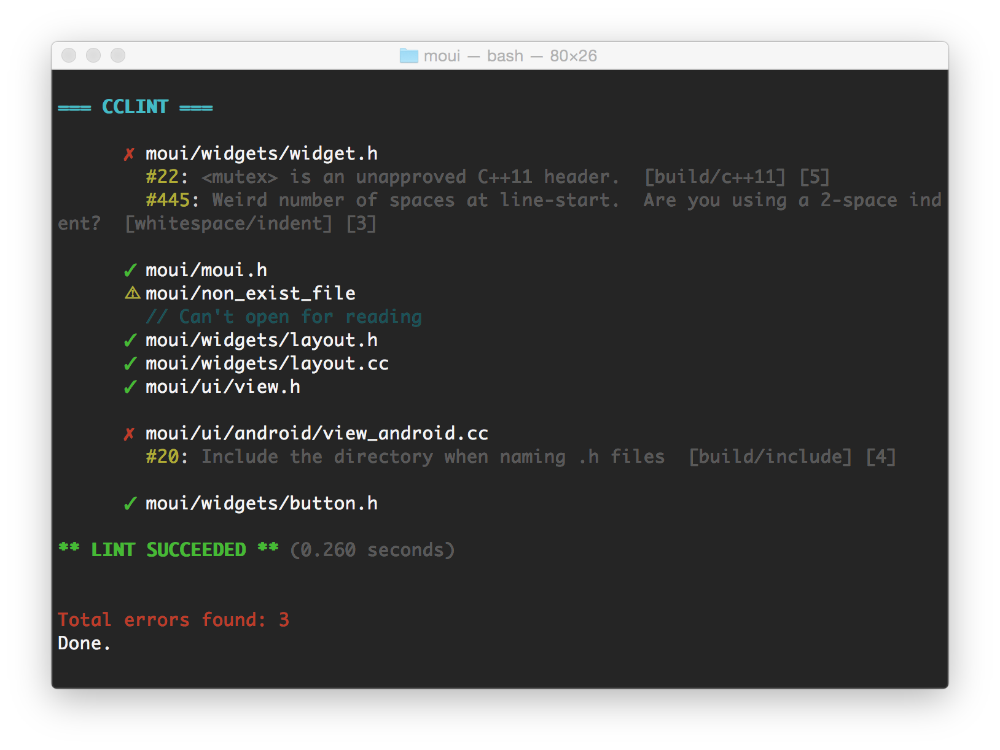

# cclint

__cclint__ is an enhanced version of the Google's __ccplint__ tool.

## Features

__cclint__ preserves all __cpplint__'s capabilities with a few extra features:

*  **Structured output of lint results.**

    _cclint_ intercepts the output from Google's _cpplint_ and structures
    which in a human-friendly way, including ANSI-colored output that makes it
    much more readable.

    Example: 

* **Easier to include files within directories.**

    _cclint_ adds a new `expanddir` flag that allows to add files with matched
    extensions within specified directories. It also includes an option to add
    files within subdirectories recursively.

##Requirements

* Python 2.7 or later

## Installation

__cclint__ can be installed through __pip__ via

```base
pip install cclint
```

Or you can install the development version via

```bash
pip install git+git://github.com/ollix/cclint.git
```

## Usage

__cclint__'s commands and options are a superset of __cpplint__'s. So anything
you passed to __cpplint__ can be passed to  __cclint__ as well.

## License

Copyright (c) 2015 Olli Wang. All rights reserved.

Redistribution and use in source and binary forms, with or without
modification, are permitted provided that the following conditions are
met:

   * Redistributions of source code must retain the above copyright
notice, this list of conditions and the following disclaimer.
   * Redistributions in binary form must reproduce the above
copyright notice, this list of conditions and the following disclaimer
in the documentation and/or other materials provided with the
distribution.
   * Neither the name of Olli Wang nor the names of its
contributors may be used to endorse or promote products derived from
this software without specific prior written permission.

THIS SOFTWARE IS PROVIDED BY THE COPYRIGHT HOLDERS AND CONTRIBUTORS
"AS IS" AND ANY EXPRESS OR IMPLIED WARRANTIES, INCLUDING, BUT NOT
LIMITED TO, THE IMPLIED WARRANTIES OF MERCHANTABILITY AND FITNESS FOR
A PARTICULAR PURPOSE ARE DISCLAIMED. IN NO EVENT SHALL THE COPYRIGHT
OWNER OR CONTRIBUTORS BE LIABLE FOR ANY DIRECT, INDIRECT, INCIDENTAL,
SPECIAL, EXEMPLARY, OR CONSEQUENTIAL DAMAGES (INCLUDING, BUT NOT
LIMITED TO, PROCUREMENT OF SUBSTITUTE GOODS OR SERVICES; LOSS OF USE,
DATA, OR PROFITS; OR BUSINESS INTERRUPTION) HOWEVER CAUSED AND ON ANY
THEORY OF LIABILITY, WHETHER IN CONTRACT, STRICT LIABILITY, OR TORT
(INCLUDING NEGLIGENCE OR OTHERWISE) ARISING IN ANY WAY OUT OF THE USE
OF THIS SOFTWARE, EVEN IF ADVISED OF THE POSSIBILITY OF SUCH DAMAGE.
